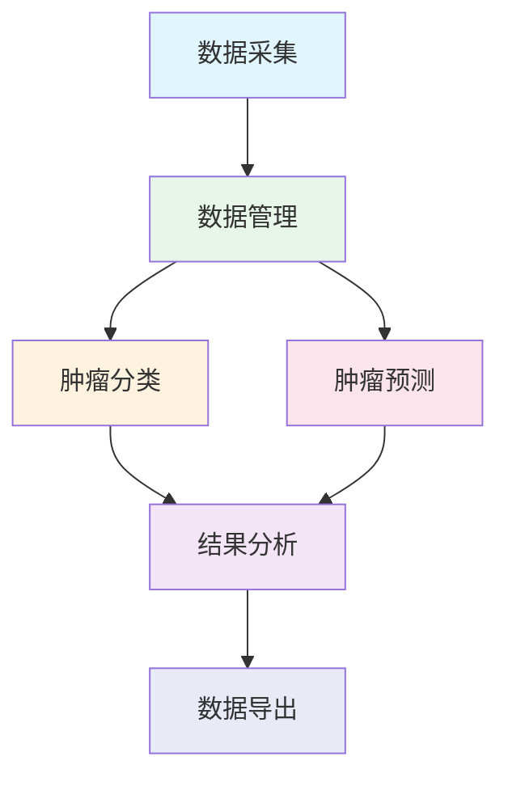
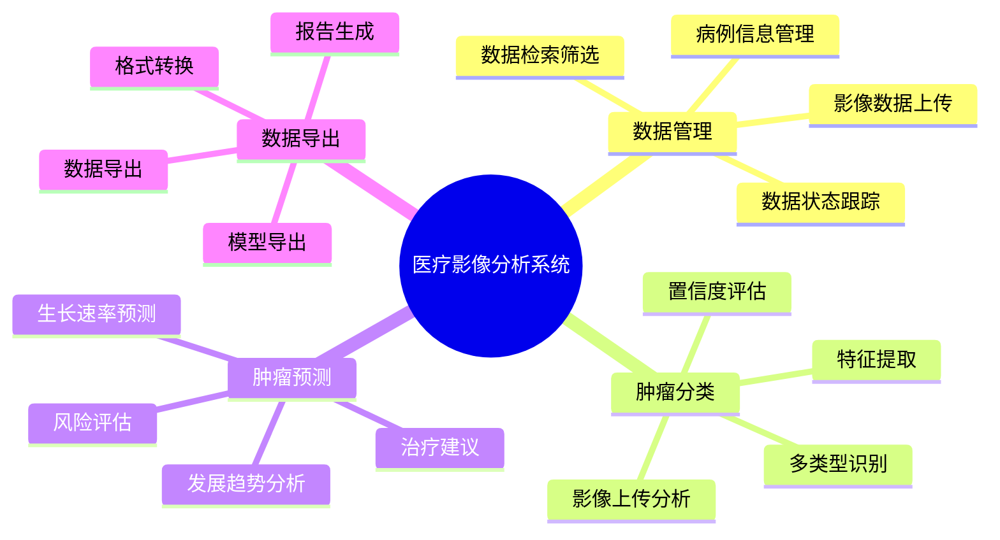
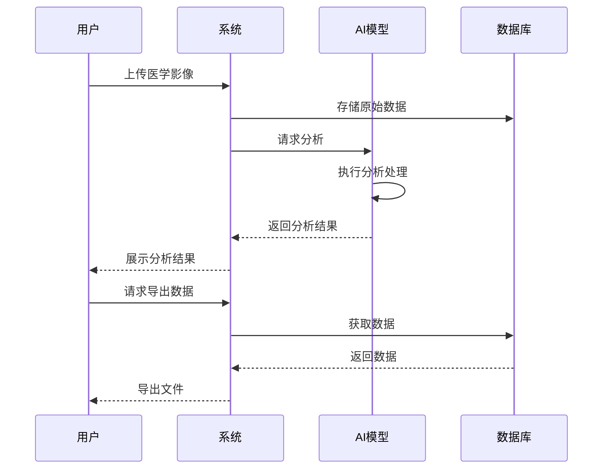

# 医疗影像分析系统产品介绍

## 1. 产品概述

医疗影像分析系统是一个基于深度学习技术的智能医疗辅助诊断平台，主要用于肿瘤的分类、预测和数据管理。系统集成了先进的人工智能算法，为医疗机构提供高效、准确的肿瘤诊断支持服务。

## 2. 应用流程

## 3. 功能结构

## 4. 使用说明

### 4.1 数据管理模块

数据管理模块提供完整的医疗数据管理功能，包括：

- **病例信息管理**：支持患者基本信息、检查记录的录入和管理
- **数据上传**：支持医学影像、诊断报告等多种格式文件的批量上传
- **智能检索**：提供多维度的检索筛选功能，快速定位所需数据
- **状态追踪**：实时显示数据处理状态，确保数据完整性

### 4.2 肿瘤分类模块

肿瘤分类模块采用深度学习技术，提供：

- **智能分类**：自动识别肿瘤类型，支持多种常见肿瘤的分类
- **置信度分析**：提供分类结果的置信度评估，辅助医生决策
- **特征提取**：自动提取肿瘤特征，如边缘特征、密度分布等
- **可视化展示**：直观展示分类结果和关键特征

### 4.3 肿瘤预测模块

肿瘤预测模块基于历史数据和深度学习模型，提供：

- **趋势分析**：预测肿瘤发展趋势，评估生长速率
- **风险评估**：对肿瘤发展风险进行等级划分
- **治疗建议**：基于预测结果提供初步的治疗建议
- **进度跟踪**：分步骤展示预测分析过程

### 4.4 数据导出模块

数据导出模块支持多种格式的数据导出功能：

- **模型导出**：支持多种深度学习框架格式的模型导出
- **数据导出**：支持 Excel、CSV、PDF 等多种格式的数据导出
- **自定义导出**：可选择导出内容和格式，支持匿名化处理
- **批量处理**：支持批量数据的导出和下载

## 5. 功能建模

## 6. 技术特点

- **深度学习算法**：采用先进的深度学习算法，提供准确的分类和预测结果
- **模块化设计**：系统采用模块化设计，各功能模块独立又相互协作
- **数据安全**：支持数据加密和匿名化处理，保护患者隐私
- **可扩展性**：系统架构支持功能扩展和模型更新
- **用户友好**：直观的操作界面，清晰的结果展示，降低使用门槛

## 7. 应用价值

- **提高效率**：自动化的分析流程，大幅提高医生工作效率
- **辅助决策**：提供客观的分析数据，辅助医生进行诊断决策
- **标准化**：统一的分析标准，减少主观判断差异
- **科研价值**：积累大量标准化数据，为医学研究提供支持
